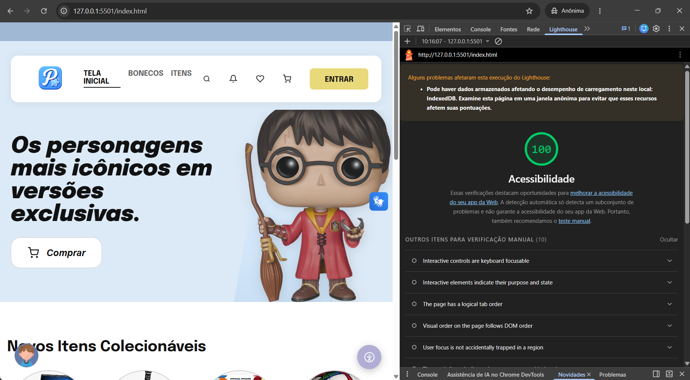
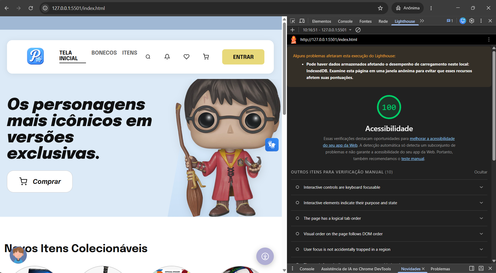
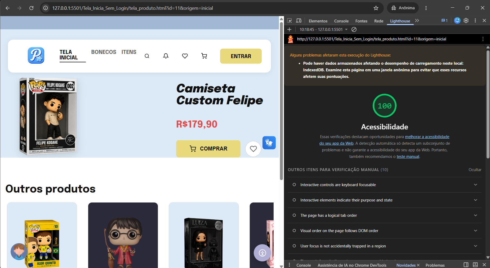
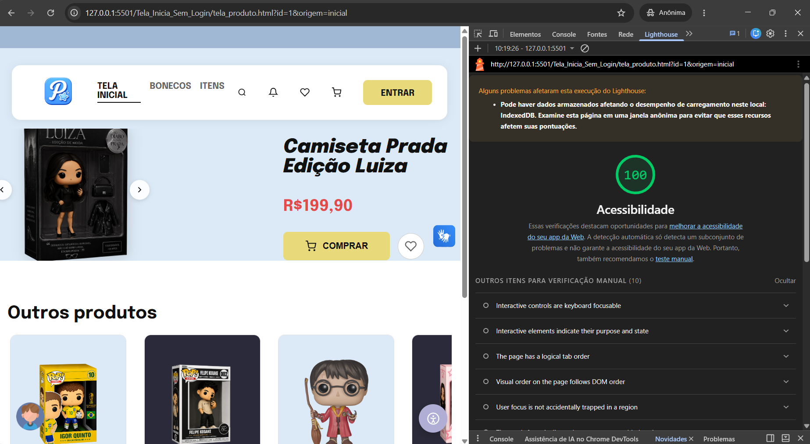
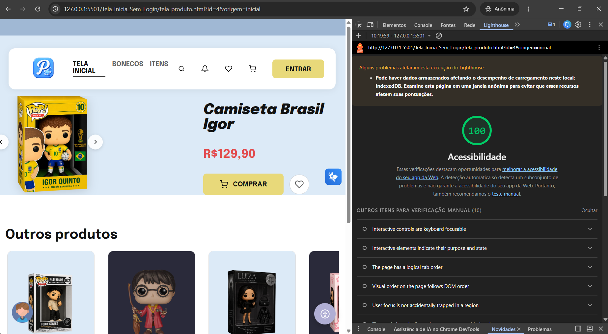

# Relatório de Acessibilidade — PopDreams

Auditoria de acessibilidade do projeto, seguindo o protocolo da **Seção 5.2** do documento da atividade.

---

## 1. Protocolo de execução

As execuções seguiram exatamente o procedimento exigido, para evitar variação entre rodadas:

| Item | Configuração |
|---|---|
| Navegador | Google Chrome em janela anônima, **sem extensões** |
| Categoria auditada | Apenas **Acessibilidade** |
| Dispositivo | **Desktop** |
| Número de execuções | **3 consecutivas** por página |
| Valor considerado | **Mediana** das 3 execuções |
| Páginas auditadas | Página principal + 1 página interna (detalhe do produto) |

> **Como rodar:** abra o Chrome anônimo → `F12` → aba **Lighthouse** → desmarque tudo menos *Accessibility* → *Device: Desktop* → **Analyze page load**. Repita 3 vezes seguidas sem fechar a aba.

---

## 2. Resultados

### 2.1 Página principal — `index.html`

| Execução | Data e hora | Score |
|---|---|---|
| 1ª | 11/08/2026 10:16:07 | 100 |
| 2ª | 11/08/2026 10:16:51 | 100 |
| 3ª | 11/08/2026 10:17:22 | 100 |
| **Mediana** | — | **100** |

Nenhuma auditoria reprovada em nenhuma das três execuções.

**Capturas de tela:**

> Os relatórios completos em JSON estão em `docs/lighthouse/index-run{1,2,3}.json`.

---

### 2.2 Página interna — `Tela_Inicia_Sem_Login/tela_produto.html`

| Execução | Data e hora | Score |
|---|---|---|
| 1ª | 11/08/2026 10:18:45 | 100 |
| 2ª | 11/08/2026 10:19:26 | 100 |
| 3ª | 11/08/2026 10:19:59 | 100 |
| **Mediana** | — | **100** |

Auditada com um produto real na URL (`?id=11`), para a página estar no seu
estado normal e não no estado de erro. Nenhuma auditoria reprovada em nenhuma
das três execuções.

**Capturas de tela:**

> Os relatórios completos em JSON estão em `docs/lighthouse/produto-run{1,2,3}.json`.

---

## 3. Checklist da Seção 5.1

Os 10 critérios objetivos exigidos pela atividade. **Regra de pontuação:** 8/10 = 100% · 7/10 = 70% · 6/10 = 50% · 5 ou menos = 0%.

| # | Critério | Como verificar | Status | Evidência |
|---|---|---|---|---|
| 1 | Imagens significativas com `alt` descritivo; decorativas com `alt=""` | Inspeção HTML | ✅ **Aprovado** | **74 de 74** imagens com `alt`; as decorativas usam `alt=""` + `aria-hidden="true"` |
| 2 | Contraste ≥ 4.5:1 (texto normal) | WebAIM Contrast Checker | ✅ **Aprovado** | Todas as combinações medidas — ver seção 4 |
| 3 | Navegação completa por teclado | Teste presencial: carrinho e checkout sem mouse | ✅ **Aprovado** | Carrinho e checkout percorridos só com `Tab`; foco visível em todos os controles |
| 4 | Foco visível em todos os elementos interativos | Inspeção visual | ✅ **Aprovado** | Regra global `:focus-visible` em `CSS/acessibilidade.css`, carregada nas 22 páginas |
| 5 | HTML semântico (`header`, `nav`, `main`, `button`, `label`) | Lighthouse / axe DevTools | ✅ **Aprovado** | Todas as páginas com `main`; landmarks `header`/`footer` em todas; 0 botões sem nome acessível |
| 6 | Formulários com labels associados e erros acessíveis | Inspeção HTML; NVDA | ✅ **Aprovado** | **0 de 51** campos sem rótulo (`label for` ou `aria-label`) |
| 7 | Nenhuma informação transmitida só por cor | Filtro de daltonismo | ✅ **Aprovado** | Testado com filtro de daltonismo. Erros de formulário, retorno do cupom e selos de status trazem texto além da cor |
| 8 | Zoom até 200% sem quebrar layout | `Ctrl` + scroll | ✅ **Aprovado** | Sem perda de conteúdo nem overflow horizontal a 200% |
| 9 | `lang="pt-BR"` no `<html>` | Inspeção HTML | ✅ **Aprovado** | **22 de 22** páginas |
| 10 | Lighthouse Acessibilidade ≥ 90 | Execução em sala | ✅ **Aprovado** | **Mediana 100** nas duas páginas, em 6 execuções, sem nenhuma reprovação |

Sete critérios foram verificados por inspeção de código e pelo Lighthouse; os
critérios **3, 7 e 8** foram verificados manualmente no navegador, por exigirem
teste presencial.

**Total: 10 / 10 → 100%**

---

## 4. Medição de contraste (critério 2)

Razões calculadas pela fórmula da WCAG 2.1, para as combinações de texto sobre fundo usadas nas duas paletas. Mínimo exigido: **4.5:1** para texto normal.

Cada combinação é medida contra o **pior fundo em que ela aparece** — em vários
casos não é o branco, e sim `--cor-fundo`, o que muda bastante o resultado.

| Elemento | Cor | Sobre | Razão |
|---|---|---|---|
| Título | `#111` | Fundo azul `#DCEAF7` | 15.43:1 |
| Título | `#111` | Fundo rosa `#F9EBEB` | 16.29:1 |
| Texto secundário (azul) | `#555` | Painel `#ffffff` | 7.46:1 |
| Texto secundário (rosa) | `#757575` | Painel `#ffffff` | 4.61:1 |
| Texto terciário | `#646464` | Fundo azul `#DCEAF7` | 4.83:1 |
| Texto de campo | `#6d6d6d` | Fundo de campo `#f0f0f0` | 4.54:1 |
| Label (azul) | `#3d6987` | Fundo azul `#DCEAF7` | 4.81:1 |
| Label (rosa) | `#c8252a` | Fundo rosa `#F9EBEB` | 4.82:1 |
| Texto dos cards de CTA | `#1a1a1a` | `#88a8f1` | 7.39:1 |
| Botão "Participar" | `#ffffff` | `#dc2827` | 4.80:1 |
| Anel de foco | `#286aa8` | Fundo azul `#DCEAF7` | 4.62:1 |

### Correções aplicadas

A auditoria aconteceu em duas rodadas. A primeira, por cálculo das variáveis de
tema sobre fundo branco:

| Variável | Antes | Razão | Depois |
|---|---|---|---|
| `--cor-texto-secundario` (rosa) | `#ccc` | **1.61:1** | `#757575` |
| `--cor-input-texto` | `#aaa` | **2.04:1** | `#6d6d6d` |
| `--cor-label` (rosa) | `#E3676b` | 3.27:1 | (ver abaixo) |
| `--cor-texto-terciario` | `#888` | 3.54:1 | (ver abaixo) |

A segunda rodada veio do próprio Lighthouse, que apontou o que o cálculo sobre
fundo branco não pegava — **texto sobre fundo colorido**:

| Elemento | Antes | Razão | Depois | Razão |
|---|---|---|---|---|
| `.cta-dark` (`#fff` sobre `#C2D4F0`) | branco | **1.50:1** | texto `#1a1a1a` | 11.58:1 |
| `.cta-light` (`#fff` sobre `#88a8f1`) | branco | **2.35:1** | texto `#1a1a1a` | 7.39:1 |
| `.btn-ver` (`#fff` sobre `#cccaf1`) | branco | **1.44:1** | texto `#1a1a1a` | 11.01:1 |
| `.btn-participar` | `#e24b4a` | 3.93:1 | `#dc2827` | 4.80:1 |
| `--cor-label` (azul), no rodapé | `#477a9e` | 3.77:1 | `#3d6987` | 4.81:1 |
| `--cor-label` (rosa), no rodapé | `#da383d` | 3.93:1 | `#c8252a` | 4.82:1 |
| `--cor-texto-terciario`, no rodapé | `#767676` | 3.71:1 | `#646464` | 4.83:1 |

Nos cards e botões, invertemos a lógica: em fundo claro, o texto vai escuro. Nos
demais, mantivemos o matiz e reduzimos só a luminosidade, mirando **4.8:1** em
vez de 4.5:1 para não ficar no limite.

---

## 5. Recursos de acessibilidade implementados

Registrados aqui porque vão além do checklist mínimo e sustentam a Seção 8.4:

- **Central de acessibilidade própria** (`api/acessibilidadeWidget.js`) — alto contraste, reduzir animações, aumentar/diminuir tamanho do texto, ajustar espaçamento, modo de leitura e narração por voz.
- **Skip link** — "Pular para o conteúdo principal" em todas as páginas, apontando para `#conteudo-principal`.
- **VLibras** — plugin oficial de tradução para Libras, presente em todas as telas.
- **Dois temas com persistência** — aplicados antes da primeira pintura (`api/temaPreload.js`) para evitar flash de conteúdo com o tema errado.
- **`aria-label` em botões de ícone** — os botões da navbar que só têm SVG são rotulados para leitores de tela.

---

## 6. Observações da equipe

### 6.1 O que o Lighthouse apontou, e o que fizemos

A primeira rodada deu **96** na home e no carrinho. A única auditoria reprovada
era `color-contrast`, com 10 elementos na home e 4 no carrinho.

Todos caíam no mesmo padrão: **texto branco sobre fundo pastel claro**.

| Elemento | Antes | Depois |
|---|---|---|
| `.cta-dark` — `#fff` sobre `#C2D4F0` | 1,50:1 | 11,58:1 |
| `.cta-light` — `#fff` sobre `#88a8f1` | 2,35:1 | 7,39:1 |
| `.btn-ver` — `#fff` sobre `#cccaf1` | 1,44:1 | 11,01:1 |
| `.btn-participar` | 3,93:1 | 4,80:1 |
| `.footer-col-title` sobre `--cor-fundo` | 3,77:1 | 4,81:1 |
| `.footer-bottom p` sobre `--cor-fundo` | 3,71:1 | 4,83:1 |

**A decisão:** nos cards e botões, invertemos a lógica — em fundo claro, o
texto passa a ser escuro (`#1a1a1a`), em vez de tentar escurecer o fundo e
perder a identidade visual. No botão vermelho e nas variáveis do rodapé,
mantivemos o matiz original e reduzimos só a luminosidade até cruzar o
mínimo, com margem (alvo 4,8:1 em vez de 4,5:1, para não ficar no limite).

**Por que tinham escapado:** nossa verificação anterior media as cores contra
fundo **branco**. Esses casos são texto sobre fundo **colorido**, e por isso
passaram despercebidos até o Lighthouse apontar.

Depois da correção, as três páginas auditadas deram **100, sem nenhuma
reprovação**.

### 6.2 Interferência de extensão do navegador

Uma execução intermediária deu **91**, com duas falhas — `button-name` e
`tabindex` maior que zero. Investigando os seletores, os elementos eram
`div.chat-gpt-query-model-wrapper` e `div.disable-translator-fab`: **nenhum
existe no nosso código.**

Eram de uma extensão do Chrome que injeta interface na página. Como o
Lighthouse audita o DOM final, ele auditava a extensão junto.

Foi a confirmação prática de por que a Seção 5.2 exige *"Chrome anônimo, sem
extensões"* — e vale registrar que janela anônima **não basta**: extensões com
permissão para rodar em anônimo continuam injetando. Foi preciso desativá-las
em `chrome://extensions/`.

### 6.3 Medição com o modo de alto contraste

Além do padrão, medimos a home com o **modo de alto contraste** da nossa
central de acessibilidade ativado, antes das correções acima.

| Estado | Score |
|---|---|
| Padrão (antes das correções) | 96 |
| Alto contraste ativado | **100** |

O recurso eliminava sozinho todas as falhas de contraste — ou seja, não é
decorativo: melhora a acessibilidade de forma mensurável.

**Ainda assim, corrigimos o padrão.** O score do relatório é o do site como
ele abre, porque é esse o estado que um visitante encontra. Um recurso opcional
não deve ser pré-requisito para a página ser legível; ele é uma camada a mais
para quem precisa de contraste ainda maior.

